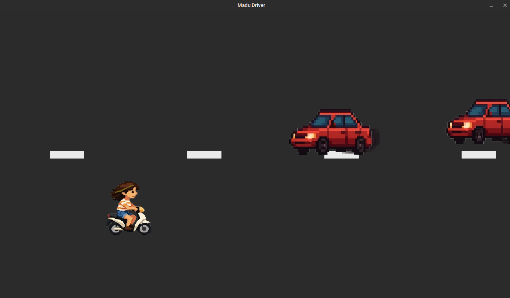
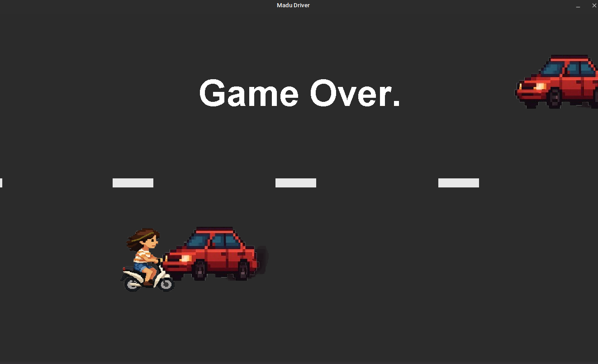

# 💖 MaduGame

**MaduGame** é um jogo simples e divertido feito inteiramente em **Java**, criado especialmente para minha namorada 💕.  
Nele, a personagem pilota sua **Honda Biz** e precisa **desviar de veículos** que aparecem de forma aleatória na tela — que, com o tempo, se tornam cada vez mais rápidos e desafiadores.

## 🚦 Sobre o jogo

A ideia é simples: sobreviver o máximo de tempo possível desviando dos carros que surgem na estrada. Com o passar do tempo, os veículos ficam mais rápidos, tornando a reação do jogador cada vez mais importante.

O jogo foi desenvolvido do zero, com foco em aprendizado, carinho e personalização.

---

## 🎮 Como jogar

- **Seta para cima (↑) ou W**: move a moto para cima
- **Seta para baixo (↓) ou S**: move a moto para baixo
- O objetivo é **não colidir com nenhum veículo**
- Quanto mais tempo você durar, **mais difícil fica!**

---

## 🧰 Tecnologias e bibliotecas usadas

O projeto foi construído com as **bibliotecas padrão do Java (AWT/Swing)**. Nenhuma dependência externa foi utilizada!

### Bibliotecas Java utilizadas:

- `java.awt.*` – gráficos, canvas, fontes e gerenciamento da janela
- `javax.swing.*` – criação da janela principal do jogo
- `java.awt.image.BufferedImage` – manipulação e exibição de sprites
- `javax.imageio.ImageIO` – carregamento de imagens
- `java.util.List`, `ArrayList`, `Random` – controle de entidades e aleatoriedade
- `java.awt.event.KeyListener` – controle de teclado

---

## 📦 Como compilar e executar

### Pré-requisitos:

- JDK 8 ou superior instalado
- Terminal ou IDE de sua preferência (IntelliJ, Eclipse, VS Code...)

### Compilação manual:

1. Compile todos os arquivos `.java`:
   ```bash
   javac -d bin src/*.java
    ```
2. Execute o jogo:
   ```bash
   java -cp bin Game
   ```
**Obs.:** Certifique-se de que os recursos (imagens/sprites) estejam no caminho correto.
**Dica:** Use `getClass().getResource("/...")` para evitar problemas em diferentes sistemas operacionais.

---

## ❤️ Uma homenagem

Este jogo foi criado com muito carinho para a pessoa **incrível** que é a **minha namorada**!
Nenhuma ideia me fez tão **feliz** quanto essa. Unir programação, criatividade e amor em um projeto único para fazer a pessoa que **eu amo** feliz. ✨

--- 

## 📸 Screenshots





---

## 📄 Licença

Este projeto foi feito com fins educacionais e pessoais. Sinta-se livre para explorar e brincar com o código!